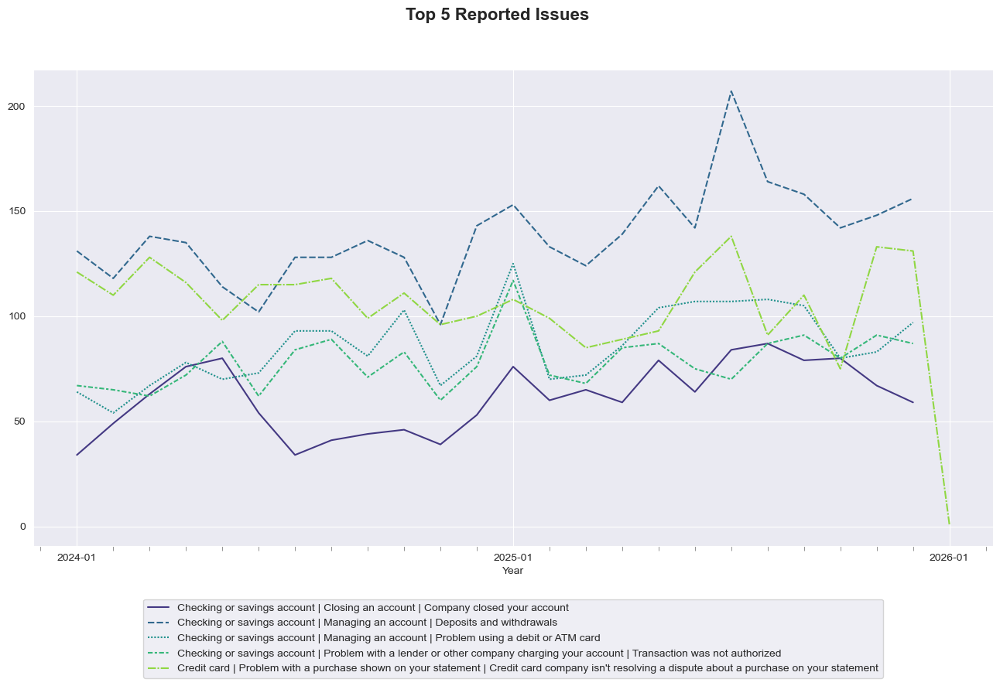
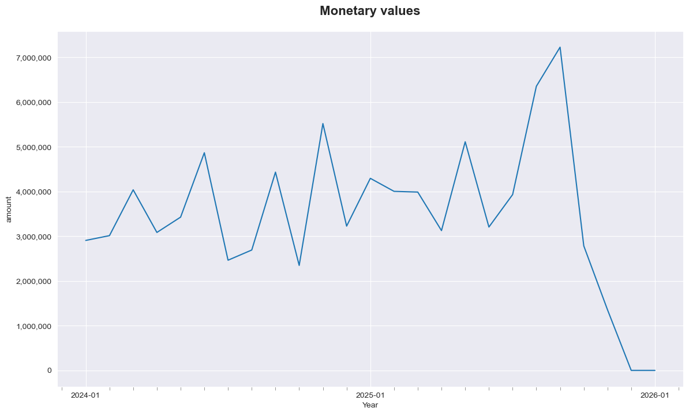
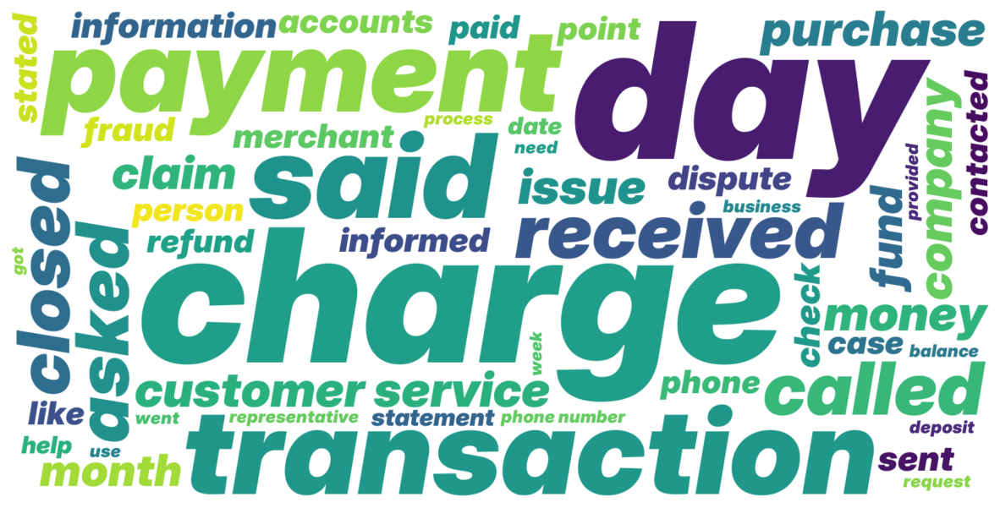
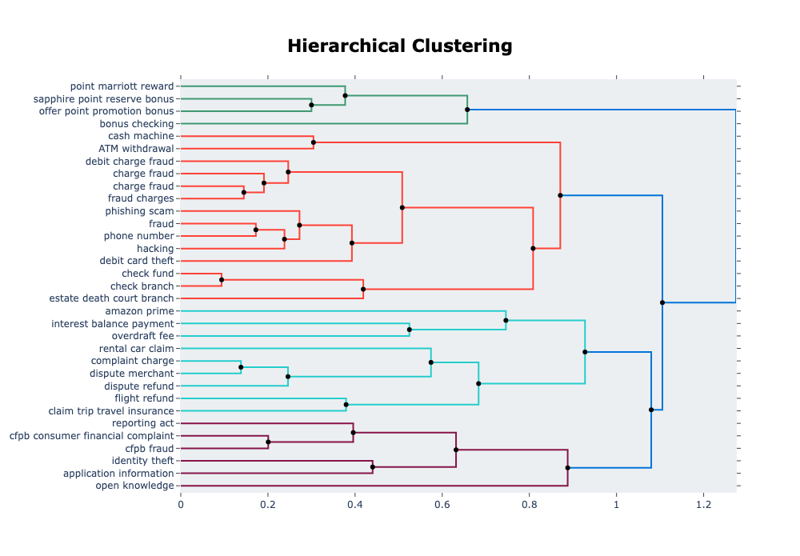
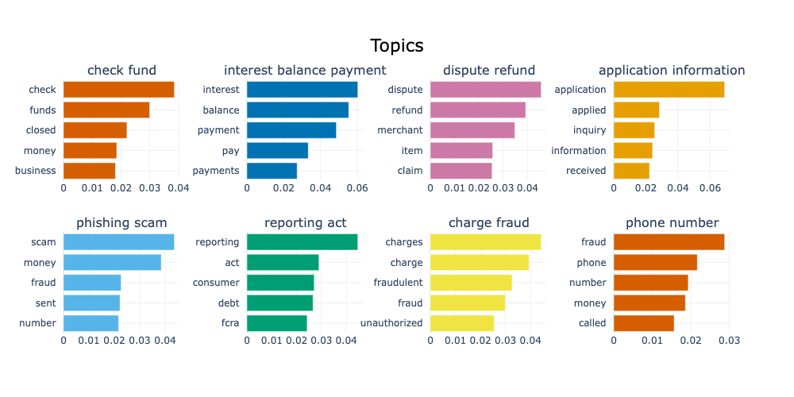
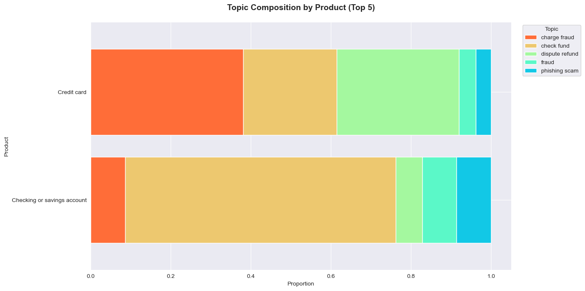
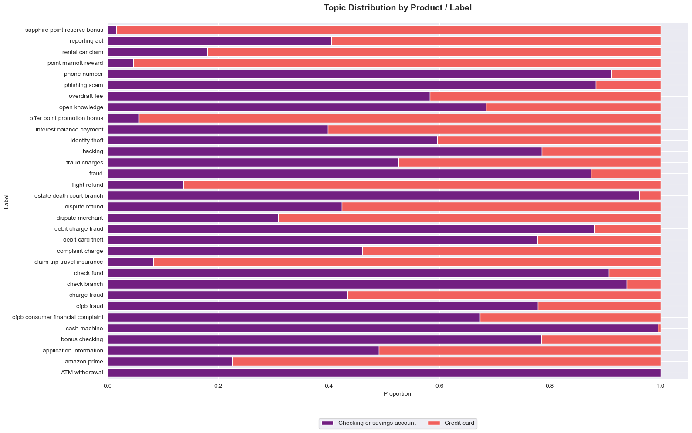

# JPMorgan Chase — Consumer Complaint Analysis

An end-to-end analysis of consumer complaints filed against JPMorgan Chase with the Consumer Financial Protection Bureau (CFPB). The project combines exploratory data analysis with NLP-driven topic modelling to identify where the company should target investment to reduce complaint volume, improve customer outcomes, and maintain regulatory compliance.

---

## Business Context

JPMorgan Chase is planning for the next financial year. The Chief Financial Officer and Customer Success Officer need to identify key areas for improvement — specifically, where investment can reduce complaint volume, improve customer outcomes, and ensure compliance with laws and regulations.

This analysis answers that question in two ways:

1. **EDA & Visualisation** — understanding complaint patterns by product, issue, time, and monetary impact
2. **NLP / Topic Modelling (BERTopic)** — discovering latent themes in free-text complaint narratives that structured fields alone don't capture

---

## Data Source

All data comes from the [CFPB Consumer Complaint Database](https://www.consumerfinance.gov/data-research/consumer-complaints/), filtered to JPMorgan Chase complaints from January 2021 to November 2025.

| File | Description |
|------|-------------|
| `complaints-2026-01-06_19_35.csv` | Credit card and prepaid card complaints |
| `complaints-2026-01-08_18_37.csv` | All JPMorgan Chase complaints across all products |

Key fields used: `Product`, `Issue`, `Sub-issue`, `Consumer complaint narrative`, `Date received`, `Company response to consumer`.

---

## Analysis Overview

### 1. Exploratory Data Analysis

- **Complaint volume over time** — histogram and KDE of complaint submission dates
- **Missing data audit** — bar chart of NaN values per column
- **Product breakdown** — pie chart showing the share of complaints by product category (Credit Card, Checking/Savings, Credit Reporting, etc.)
- **Issue breakdown** — separate pie charts for the top issues within Credit Cards and Checking/Savings Accounts
- **Trend analysis** — line plots tracking products, issues, and sub-issues over time (monthly)
- **Top reported issue combinations** — the most frequent Product + Issue + Sub-issue triples, tracked over time

The two largest complaint categories (Credit Cards and Checking/Savings Accounts) are separated and analysed individually, with sub-issue trends plotted over time for each.

### 3. Text Processing

- **Dollar amount extraction** — regex-based extraction of monetary values from complaint narratives, aggregated monthly to show financial impact trends
  

- **Text cleaning pipeline** — built with spaCy, including removal of CFPB masking characters, stopwords (with domain-specific additions like "chase", "bank", "credit"), punctuation, numbers, URLs, and HTML tags
- **Word frequency analysis** — bar chart of the most common terms after cleaning
- **Word cloud** — visual summary of the most prominent vocabulary across all complaints

### 4. Topic Modelling with BERTopic

A BERTopic pipeline discovers complaint themes from the cleaned narratives:

- **Embedding model:** `all-MiniLM-L6-v2` (sentence-transformers)
- **Dimensionality reduction:** UMAP (3 components)
- **Clustering:** HDBSCAN (min cluster size = 50)
- **Term weighting:** c-TF-IDF with bigrams

Outliers are reassigned using BERTopic's embedding-based strategy.

### 5. Topic Label Refinement

Raw BERTopic keyword labels go through a three-step refinement:

1. **Normalisation** — lemmatisation and deduplication of keywords via spaCy
2. **Fuzzy deduplication** — merging near-duplicate topics using rapidfuzz (token sort ratio ≥ 90)
3. **Human-readable relabelling** — Flan-T5 (`google/flan-t5-base`) generates concise 3-word topic names from the keyword sets

### 6. Topic Visualisation & Cross-Analysis

- BERTopic built-in plots: topic similarity heatmap, intertopic distance map, hierarchy dendrograms, bar charts

- Topics over time — line plot of the top topics by month
- Topic × Product heatmap — which topics dominate which product categories
- Stacked bar breakdowns — topic composition by Product, Issue, Sub-issue, and full combo

- Per-topic word clouds — individual word clouds exported as PNG for each discovered topic

---

## Key Outputs

- Trend charts identifying which complaint categories are growing or declining
- Dollar-amount analysis showing the financial scale of complaints over time
- A set of discovered complaint topics with human-readable labels
- Cross-tabulations revealing which topics map to which products and issues
- Per-topic word clouds exported as individual PNG files
- Actionable insight into where JPMorgan Chase should prioritise investment to reduce complaints
